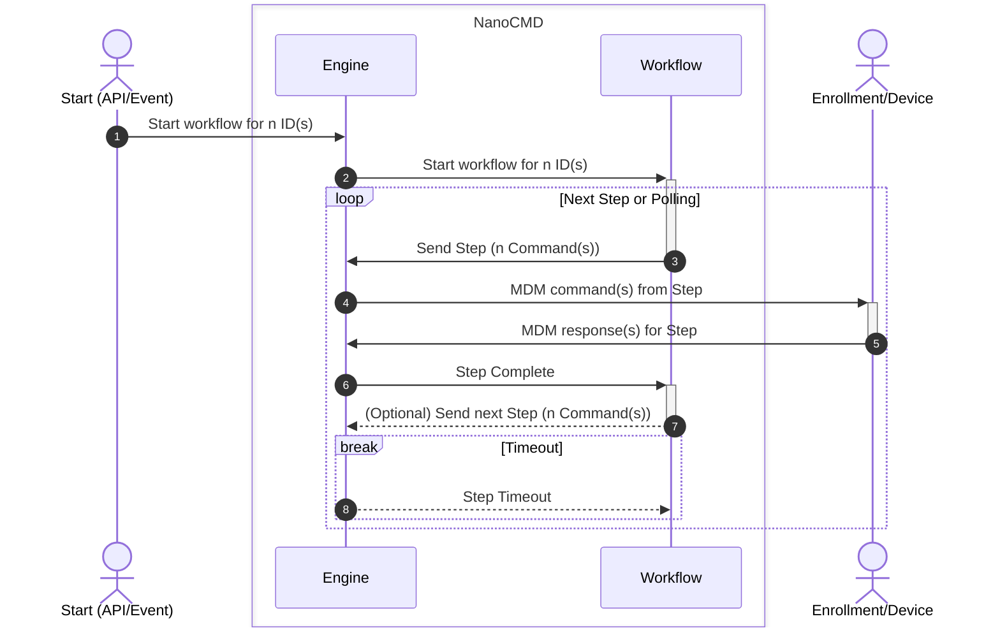

# NanoCMD

NanoCMD is a modular Go library and reference server for abstracting Apple MDM commands and responses into a concept of workflows.

The NanoCMD project is comprised of three major components:

* **Workflows**: domain-specific sequences of Apple MDM "v1" commands and responses.
* **Subsystems**: simple reference implementations of domain-specific MDM infrastructure.
* The **Workflow Engine**: intermediary and logisitcal coordinator between MDM servers and workflows.

These are discussed more below.

NanoCMD tries to be modular, componentized, and somewhat unopinionated. While it ships with a reference server that can be used itself in a turn-key fashion the project can also be imported as a library to build your own workflows, implement custom subsystems or adapters, etc.

## Getting started & Documentation

- [Quickstart](docs/quickstart.md)  
A guide to getting NanoCMD up and running quickly.

- [Operations Guide](docs/operations-guide.md)  
A brief overview of operating the NanoCMD server including command line and API interfaces.

## Getting the latest version

* Release `.zip` files containing the server should be attached to every [GitHub release](https://github.com/micromdm/nanocmd/releases).
  * Release zips are also [published](https://github.com/micromdm/nanocmd/actions) for every `main` branch commit.
* A Docker container is built and [published to the GHCR.io](http://ghcr.io/micromdm/nanocmd) registry for every release.
  * `docker pull ghcr.io/micromdm/nanocmd:latest` — `docker run ghcr.io/micromdm/nanocmd:latest`
  * A Docker container is also published for every `main` branch commit (and tagged with `:main`)
* If you have a [Go toolchain installed](https://go.dev/doc/install) you can checkout the source and simply run `make`.

## What NanoCMD is not

NanoCMD is neat. But there are some things it does not do. There are also some things that are out of scope that it may never do. Here's some of the things NanoCMD is not:

* *Not* a complete MDM server solution. As we like to say: it is not a product. 😉
* *Not* an exhaustive inventory of all MDM commands, workflows, or subsystems. This project is primarily focused on the engine and workflow interface.
* We expect that Declarative Management will lessen the need for NanoCMD over time. See the note below about DDM.
* *Not* a "fleet management" tool or "orchestrator" (at least not yet). The NanoCMD server is currently ad-hoc/API and event driven. It does not have a concept of a "fleet" or automatically managing workflows _across_ a group of machines. At least not yet.
  * You can trivally script this capability with your own list of devices with e.g. `curl` but it is not built-in.
  * We may never get this ability and instead focus on Declarative Management.
* *Not* all encompasing (i.e. an MDM server product). NanoCMD is limited in scope. Before submitting a PR for a major feature please drop the maintainers a message to discuss first.

## Overview

Why does one need all this complexity related to MDM commands? In short: because some (sets of) MDM commands require it. Take a look at this [blog post from Kandji about MDM software updates](https://blog.kandji.io/managing-software-updates-mdm). Notice the description of the "flow" of these MDM commands and diagram of the back-and-forth of the commands. This is just the reality of some MDM command worklfows.

NanoCMD tries to provide a mechanism with its workflow APIs to accomplish this sort of back-and-forth for MDM commands. Here's a sequence diagram to (hopefully) better illustrate. It outlines the general flow into and out of the workflow engine and workflows for a given workflow start:

Not shown in this diagram is that the output of most workflows talk to the subsystems to store/persist data. This diagram is mostly illustrating the workflow sequence between the workflow, engine, and enrollment (device).

### Workflows

Workflows adhere to the set of interfaces that the workflow engine provides for coordinating MDM commands and responses. A workflow is the specific implementation using those interfaces.

The intent with workflows is to take away ~~some~~a lot of the drudgery of dealing with sending and receiving MDM commands and processing responses. By doing this we can give more focus to the higher-level goals of what those MDM commands and responses are supposed to accomplish. To that end the workflows are provided with a number of features by the workflow engine. For example as a workflow many things are taken care of for you automatically:

* Command responses are "routed" back to you after you send them
* Command responses are unmarshalled into the correct and specific MDM *structured* response type
* Multiple grouped commands (called *steps*) are recevied all at once when they complete. You don't need to track ordering or complete status.
* Straight-forward coordination of *sequences* of MDM commands — especially those that need to take different action depending on the outcome of previous commands.
* "Future" command (step) scheduling. This effectively allows for ad-hoc context-aware temporary command *polling*
* Consistent context interface that can be passed between steps. Storage/persistence of this context is also transparently handled by the engine for you.
* In addition to workflow steps you can optionally get notified of any *arbitrary* command type that was sent by the engine — by any workflow.
* Optionally get notified and take action on MDM *events* (such as enrollment or check-out)

As well, the engine works to make sure workflows don't have to worry about things like:

* `NotNow` responses: the engine keeps track of actual command completion and only hands over completed commands.
* Re-sending push notifications for outstanding steps (MDM commands)
* "Exclusivity" tracking: the engine, by default, prevents multiple workflows from running at a time for an enrollment. This prevents "stacking" of steps/commands being queued for a device that hasn't yet dealt with its previous set of commands.
* Steps timeouts: Workflow steps can configure a Timeout that the engine manages. The workflow will get notified when that timeout elapses without command responses.
* Marshaling and unmarshaling proper commands: the engine knows which command responses came from what type of command Request Types, so it'll properly hand over the correct already-unmarshalled command responses for you to work with.

The workflow interface is relatively simple with much of the heavy lifting and logistics being taken care of by the engine. This frees the workflow developer to concentrate on accomplishing useful things with the MDM commands rather than worry about the above logistics.

The [operations guide](docs/operations-guide.md) discusses the specific workflows included in NanoCMD.

### Subsystems

Subsystems are "reference" implementations of MDM "infrastructure." The included subsystems are domain-specific, limited in scope, and generally simple. For example one subsystem is for Configuration Profiles. The subsystem provides the capability for working with its data (e.g. via the API). But the real usefulness comes from workflows that need to use this functionality. E.g. some workflows depend on having access to read profiles. The profile subsystem facilitates that capability.

Note that "subsystem" is just the name of NanoCMD's built-in MDM/domain-specific infrastructure. While they do have a shared similar design they need not be treated as design advice. If NanoCMD is imported into your project and/or you use it as a library then workflows can interface with whatever infrastructure they need in whatever way makes sense for them.

The [operations guide](docs/operations-guide.md) discusses the specific subsystems included in NanoCMD.

### Engine

The workflow engine is what coordinates MDM commands and responses with the workflows interface. It communicates with MDM servers, including sending MDM commands and receiving responses and events, and coordinates most of the underlying data so that the workflows don't have to.

As just one (important) example it keeps track of the Request Type of an MDM command that is enqueued to an MDM server and associates this with the command UUID. In this way when we receive the response command UUID we can lookup the Request Type of the original command and instantiate the correct response type. This all happens before responses are delivered to the workflow so a workflow doesn't need to worry about that bookkeeping. It can just deal with the responses to the commands it sent.

## What about Declarative Device Management?

It would seem this is an odd project to release this late in the MDM game. So why invest in this? While we fully realize MDM "v1" commands and responses will likely be deprecated in favor of Declarative Management counterparts, there's a few reasons to continue with this:

There's a few reasons:

* Older devices/OSes still need to support MDM v1.
* Some MDM operations may continue to be (or stay) MDM v1-only.
* Bugs or delays in Declarative Management features.
* At the time it was written the workflows that were required were not avaialble as Declarative Management functionality yet.
